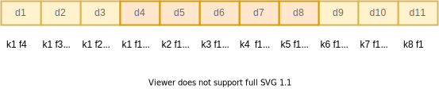

***
## Summary

[IMG_DIR]:../../images/Blogs/Exploring-between-two-type-1-d-conv-&-Concatenation

<article class="message message-immersive is-primary">
  

    <i class="fas fa-globe-asia mr-2"></i>This article is also available in 
    <a href="/cn/随笔/探究1维卷积的实现/">简体中文</a>.
  

</article>

<!-- more -->
***
## Background

***
## Main Idea
### 1-D串行

***
### 1-D并行

### 1-D拼接

***
## Outcome

Comparation of Operations size between **type1** and **type2**

| Operations | 并行 | 串行 |
| :----: | :----: | :----: |
| 乘法周期 | 8个  | 44个 |  
| 加法周期 | 8个  | 44个 |  
| 乘法单元 | 4个  | 1个  |  
| 加法单元 | 4个  | 1个  |  
| 状态机 | 1个  | 2个  | 
| 寄存器阵列 | 3个  | 3个  |      