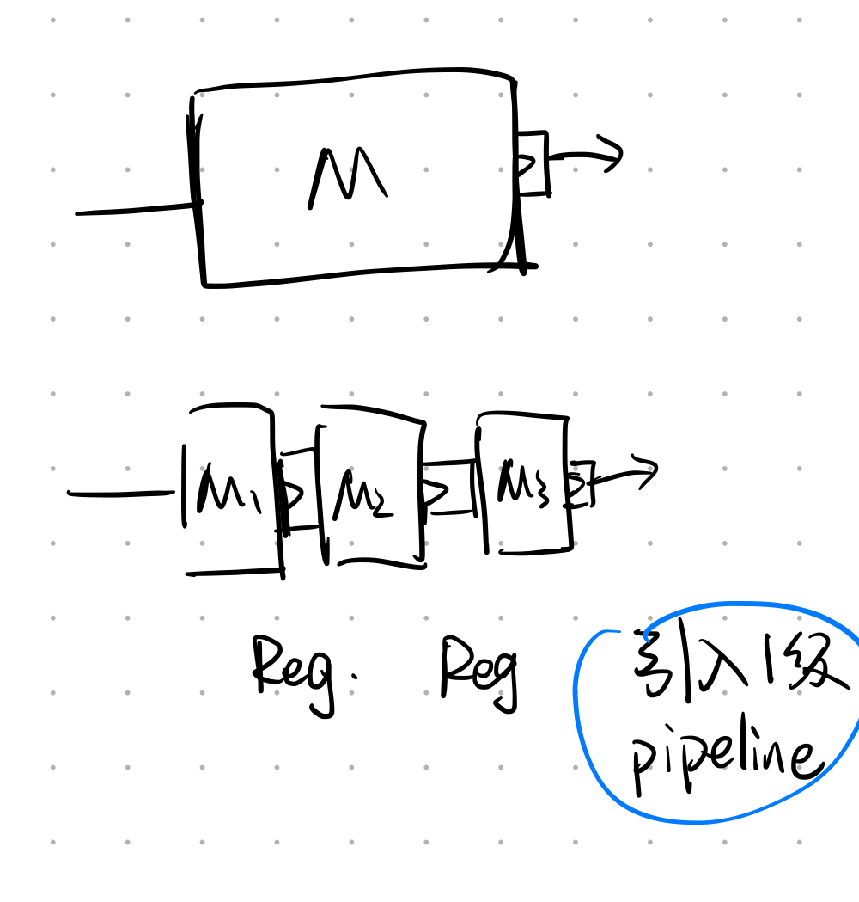

## Summary

[IMG_DIR]:../../images/Blogs/Exploring-between-two-type-1-d-conv-&-Concatenation

<article class="message message-immersive is-primary">
  

    <i class="fas fa-globe-asia mr-2"></i>This article is also available in 
    <a href="/cn/随笔/探究pipeline对于模块能耗的影响/">简体中文</a>.
  

</article>

<!-- more -->

***
## Analysis: Single Module

***
### Background
引入k级pipeline以后(使用k-1个Reg.):

### Some Symbol

| Symbol | Description | Notes |
| :---- | :---- | :---- |
| $P_{M,Static}$ | M的静态功率  |  |  
| $W_{M,Dynamic}$ | M的动态功耗 | 完成一次运算消耗的能量，暂不考虑随着频率变化而改变 |  
| $T_{M}$ | M的时延  |  |  
| $P_{R,Static}$ | Reg.的静态功率  | 引入一级Pipeline所需的Reg  |  
| $W_{R,Dynamic}$ | Reg.的动态功耗  | 完成一次运算消耗的能量，暂不考虑随着频率变化而改变  | 
| $T_{R}$ | Reg.的时延  |  |  
| $PPW$ | 能耗比(Performance Per Watt) | 完成一次运算所需能量 |

 

***
### 时延

$
T_{k} = \frac{T_{M}}{k} +T_{R}
$

***
### 静态功率

$
\begin{aligned}
P_{k,Static} & = (k-1) \cdot P_{R,Static} + P_{M1,Static} + P_{M2,Static} +... + P_{Mk,Static}  \\\\
 & = (k-1) \cdot P_{R,Static} + P_{M,Static}
\end{aligned}
$

***
### 动态功率

$
\begin{aligned}
W_{k,Dynamic} & = (k-1) \cdot W_{R,Dynamic} + W_{M1,Dynamic} + W_{M2,Dynamic} +... + W_{Mk,Dynamic}  \\\\
 & = (k-1) \cdot W_{R,Dynamic} + W_{M,Dynamic}
\end{aligned}
$

***
### 能耗比

$
\begin{aligned}
PPW &= \frac{1}{P_{k,Static} \cdot T_{k} + W_{k,Dynamic} } \\\\
 & = \frac{1}{[(k-1) \cdot P_{R,Static} + P_{M,Static}]\cdot(\frac{T_{M}}{k} +T_{R})+ (k-1) \cdot W_{R,Dynamic} + W_{M,Dynamic}} \\\\
 & = \frac{1}{k \cdot (P_{R,Static}T_{R}+W_{R,Dynamic}) + \frac{1}{k} \cdot (P_{M,Static}T_{M}-P_{R,Static}T_{M}) - P_{R,Static}T_{R} +P_{R,Static}T_{M} +P_{M,Static}T_{R} - W_{R,Dynamic} + W_{M,Dynamic}} \\\\
 & \le \frac{1}{ 2\sqrt{(P_{R,Static}T_{R}+W_{R,Dynamic}) \cdot (P_{M,Static}T_{M}-P_{R,Static}T_{M})} - P_{R,Static}T_{R} +P_{R,Static}T_{M} +P_{M,Static}T_{R} - W_{R,Dynamic} + W_{M,Dynamic}} \\\\
 & when \ and \ only \ when \ \ k= \sqrt{\frac{P_{M,Static}T_{M}-P_{R,Static}T_{M}}{P_{R,Static}T_{R}+W_{R,Dynamic}}} , \ we \ have \ PPW_{max}
\end{aligned}
$

***
## Analysis: Multi-States Module

### Some Symbol

| Symbol | Description | Notes |
| :---- | :---- | :---- |
| $P_{C_{mn},Static}$ | $C_{mn}$的静态功率  |  |  
| $W_{C_{mn},Dynamic}$ | $C_{mn}$的动态功耗 | 单个Cell完成一次运算消耗的能量，暂不考虑随着频率变化而改变 |  
| $T_{C_{mn}}$ | $C_{mn}$的时延  |  |  
| $P_{R,Static}$ | Reg.的静态功率  | 引入一级Pipeline所需的Reg  |  
| $W_{R,Dynamic}$ | Reg.的动态功耗  | 完成一次运算消耗的能量，暂不考虑随着频率变化而改变  | 
| $T_{R}$ | Reg.的时延  |  |  
| $PPW$ | 整个模块的能耗比(Performance Per Watt) | 整个模块的完成一次运算所需能量 |

### 时延

整个网络共享最大时延
$
T_{k} = \frac{T_{M}}{k} +T_{R}
$

***
### 静态功率

$
\begin{aligned}
P_{k,Static} & = (k-1) \cdot P_{R,Static} + P_{M1,Static} + P_{M2,Static} +... + P_{Mk,Static}  \\\\
 & = (k-1) \cdot P_{R,Static} + P_{M,Static}
\end{aligned}
$

***
### 动态功率

$
\begin{aligned}
W_{k,Dynamic} & = (k-1) \cdot W_{R,Dynamic} + W_{M1,Dynamic} + W_{M2,Dynamic} +... + W_{Mk,Dynamic}  \\\\
 & = (k-1) \cdot W_{R,Dynamic} + W_{M,Dynamic}
\end{aligned}
$

***
### 能耗比
$
\begin{aligned}
PPW &= \frac{1}{\sum_{m=1}^{M} \sum_{n=1}^{N} (P_{m,n,k,Static} \cdot T_{m,n,k} + W_{m,n,k,Dynamic}) }
\end{aligned}
$

***
## Outcome

To be continue..

