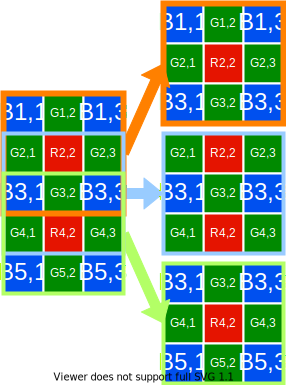
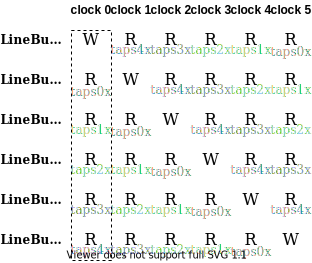
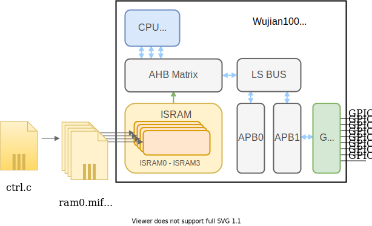

---

## Summary

`Verilog，Modelsim, Quarus II, FPGA`

+ 使⽤ FPGA 实现去⻢赛克&中值滤波的硬件结构，使⽤ wujian100 作为控制模块
+ 增加并⾏去⻢赛克模块节约了 40%的 Liner-Buffer（相较传统架构）

<article class="message message-immersive is-primary">
  

    <i class="fas fa-globe-asia mr-2"></i>This article is also available in 
    <a href="/cn/项目/基于FPGA的实时Biliner去⻢赛克设计/">简体中文</a>.
  

</article>

<!-- more -->

---

## Background

Bilinear是比较常见的Demosaicing算法。当我们先做Demosaicing再做中值滤波时，由于rwa2rgb过程会使数据信息密度降低(10bit raw -> 3*8bit rgb)，采用3组Demosaicing算子并行运算可以**减少40% Liner-Buffer使用**。

---

## Main Idea

### Liner-Buffer Architecture

通过6组同步RAM实现5组异步Line-Buffer

---

### Demosaicing Architecture

+ 使用5x3的Demosaicing-Mask，将其拆分为3个3x3的Mask(数据复用的思想)分别输入到3个并行的Demosaicing模块中。
+ 输出的3个rgb数据分别进入中值滤波器中，与相邻时钟进入的数据一起进行3x3的中值滤波。

---

### Implementation of RISC-V CPU

本次project我们使用集成了**RISC-V CPU**的SoC(wujian100)进行模块控制

---

### Overview & Pipeline

加入pipeline设计，用少量的buffer的代价实现**低能耗**

---

## Outcome

Comparation of Line-Buffer size between **Tradition** and **Parallel** algorithm

| Line-Buffer size |  Tradition  |   Parallel   |
| :--------------: | :----------: | :----------: |
|    Demosacing    | 4 of 10bit*W | 4 of 10bit*W |
|  Median Filter  | 2 of 30bit*W | 2 of 10bit*W |
|     Totally     |   100bit*W   |   60bit*W   |

新的设计节约了40%的寄存器开销
