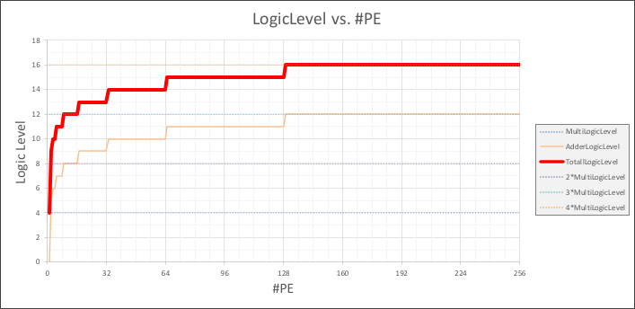

***
## Summary

`SpinalHDL, Synopsys-DC, Yosys, PTPX`

+ 以低精度混合运算为前提的 Pipeline 及脉动⾏为设计

+ 与脉动数据流解耦合的多级可变 Pipeline 设计
<!-- more -->

***
## Background

脉动阵列的Psum长度会随着多次累加的长度而上升（对数上升），其使得加法器的一个input及output长度的增加，Logic-Level（延时）增加

***
## Main Idea
### Systolic-Cell Architecture

***
### Pipeline Architecture

使用可变pipeline设计，分阶段执行乘加运算，此方案与传统脉动设计有较明显差别。

***
### Systolic-Array Architecture

增设了pipeline的脉动阵列的输入&控制行为与传统脉动 阵列相同。
由于增设了pipeline，输出数 据为多段数据，相邻数据段 相隔1clk延迟输出。

***
### Accelerator Architecture

TPU架构(GEMM加速器)，采用先脉动再移位的思想。在加速器层次进行多精度可重构设计。
每层阵列的精度为2bit*2bit，共16层阵列。可支持2-8bit混合精度数据进行矩阵乘法计算。
阵列模块后接累加模块&移位模块。累加也采用pipeline加法。

***
## Outcome

To be continue..
