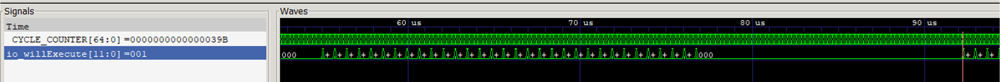
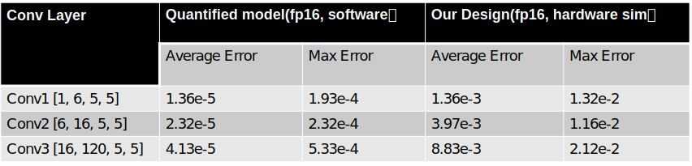

## Summary

`Verilog, Chisel3, Quarus II`

+ 在原有架构基础上引⼊ PE 内部 Pipeline 和并⾏乘加模块

<!-- more -->

---

## Background

Eyeriss是MIT于2016年提出的CNN加速器，其核心在于**尽可能多的数据复用**。本project以学习的目的复现了Eyeriss的基本功能，学习Chisel3的基本使用方法。

---

## Main Idea

### PE-Cell Architecture

考虑到实际情况中*kernel size*普遍在7及以下，此设计与论文中PE-Cell的实现略有不同。本设计使用7个MAC并行计算，由于乘/加间有Reg.其PE-Cell有内部的pipeline。

得到以上仿真结果

---

### PE-Array Architecture

Eyeriss独特的地方也在于2d-conv的实现上，每个PE可以独立完成1d-conv，PE-Array使用横行+斜线的方式输入数据实现2d-conv。

以上是我们提出的基于Eyeriss的由于Psum只在PE-Column内部流动，Columns之间的控制是解耦合的。从而有机会把PE内部的Pipeline在整个Columns上实现。

---

### Simulation

---

## Outcome

Start First Calculation： counter=0x227

Start Second Calculation:  counter=0x39B

Time cost for one calculation: T=0x39B-0x227=0x174=372 cycles
Amount of operation for one calculation(100% util rate): M=12x14x32x7x(12-7)x2=376320（12x14 Array，fmap=12, kernel=7)
Calculation force (100% util rate, 200MHz): N=M*f/T≈202 Gflops

